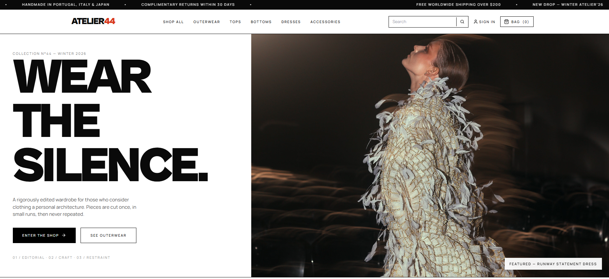
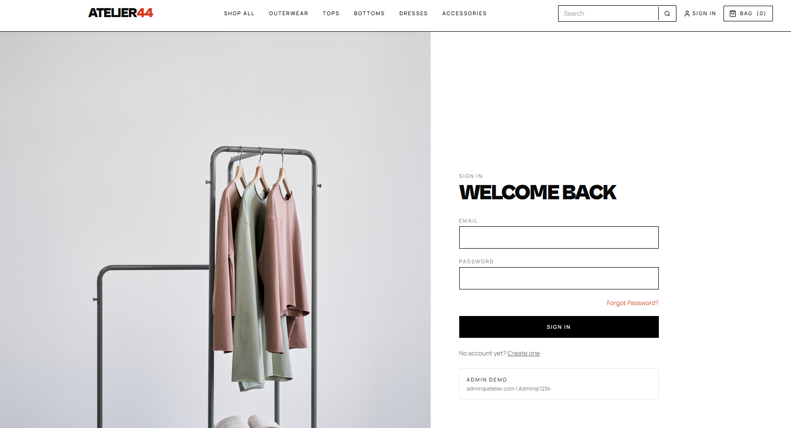
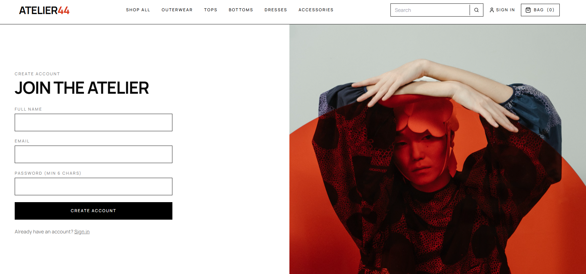
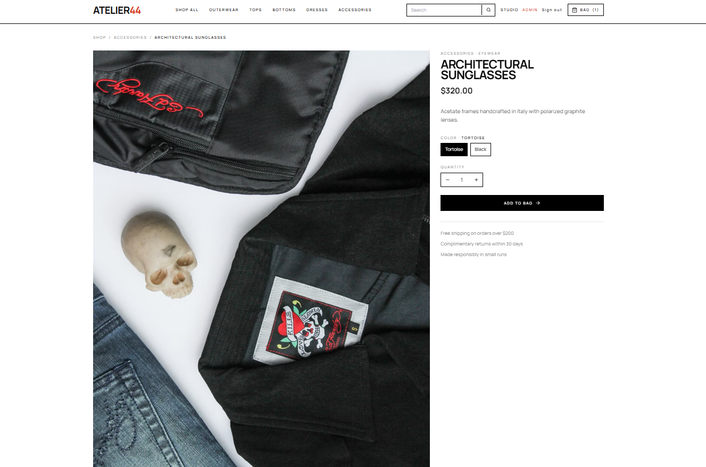
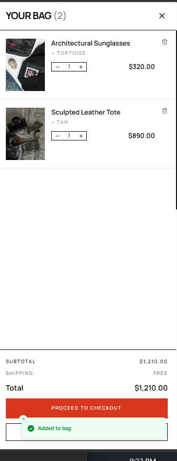
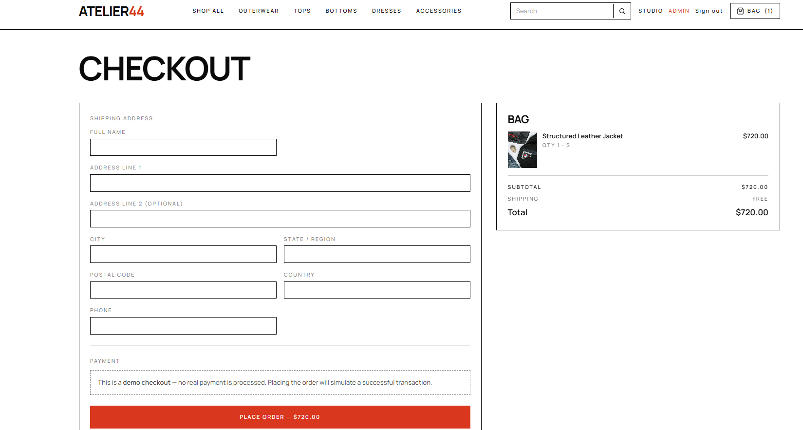

# 🛒 E-Commerce Application


A modern **full-stack E-Commerce web application** built with **React**, **FastAPI**, and **MongoDB**. The application provides secure authentication, seamless product browsing, shopping cart management, checkout functionality, and an intuitive shopping experience with a responsive user interface.

---

# 🚀 Live Demo

- **Frontend:** https://e-commerseapplication.vercel.app
- **Backend:** https://ecommerse-backend-gffh.onrender.com

---

# ✨ Features

## 👤 User Features

- Secure JWT Authentication
- User Registration & Login
- Browse Products by Categories
- Product Search
- Product Filtering
- Product Details Page
- Shopping Cart
- Checkout
- Order Placement
- Responsive Design

## 👨‍💼 Admin Features

- Add Products
- Edit Products
- Delete Products
- Manage Inventory

---

# 🛠️ Tech Stack

### Frontend

- React.js
- React Router
- Tailwind CSS
- Axios

### Backend

- FastAPI
- Python
- JWT Authentication
- Pydantic

### Database

- MongoDB Atlas

---

# 📂 Project Structure

```text
E-commerseapplication/
│
├── backend/
├── frontend/
├── assets/
│   └── screenshots/
├── README.md
└── .gitignore
```

---

# ⚙️ Installation

## Clone Repository

```bash
git clone https://github.com/saketh2504/E-commerseapplication.git

cd E-commerseapplication
```

## Backend

```bash
cd backend

python -m venv venv

# Windows
venv\Scripts\activate

pip install -r requirements.txt

uvicorn server:app --reload
```

## Frontend

```bash
cd frontend

npm install

npm start
```

---

# 📸 Screenshots

## 🏠 Home Page



---

## 🔐 Login



---

## 📝 Register



---

## 🛍️ Product Collection


---

## 🛒 Products


---

## 📦 Product Details



---

## 👜 Shopping Cart



---

## 💳 Checkout



---

# 📡 API Overview

The backend exposes RESTful APIs for:

- Authentication
- Products
- Shopping Cart
- Orders
- User Management

---

# ☁️ Deployment

- Frontend deployed on **Vercel**
- Backend deployed on **Render**
- Database hosted on **MongoDB Atlas**

---

# 🔮 Future Enhancements

- 💳 Payment Gateway Integration (Stripe/Razorpay)
- ❤️ Wishlist Feature
- ⭐ Product Ratings & Reviews
- 📧 Email Notifications
- 🚚 Live Order Tracking
- 📦 Inventory Analytics

---

# 👨‍💻 Author

**Saketh Anumari**

- GitHub: https://github.com/saketh2504
- LinkedIn: https://www.linkedin.com/in/saketh-anumari-ba85a42bb/

---

## ⭐ Support

If you found this project useful, consider giving it a ⭐ on GitHub.